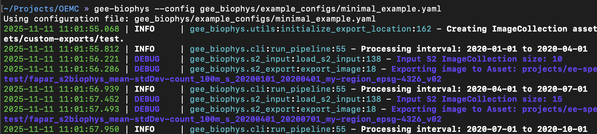
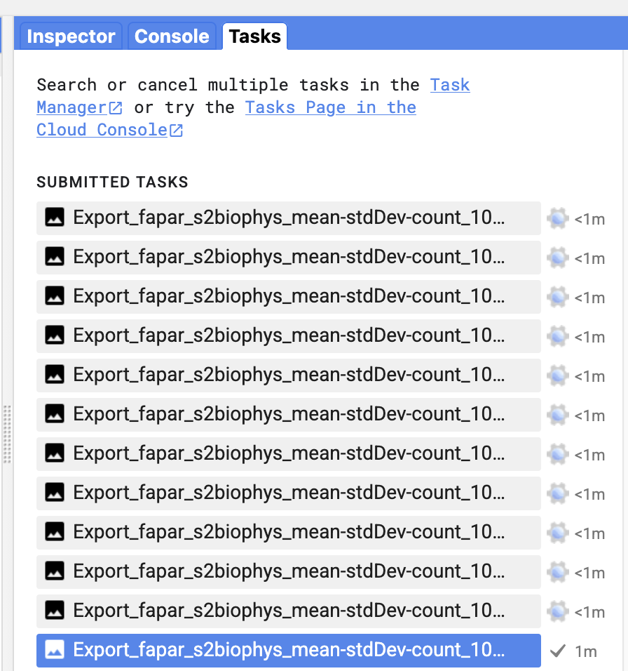

# gee-biophys

**Custom temporal exports of biophysical variable retrievals (LAIe, FAPAR, FCOVER) from Sentinel-2 imagery.**

This tool enables users to define custom time windows, temporal frequency, regions, and export settings for Sentinel-2–based biophysical variable retrievals using a simple YAML configuration file.
 It provides both:

- a **Python API**, and
- a **Command-Line Interface (CLI)**: `gee-biophys`.

------

## Overview

**gee-biophys** enables flexible and reproducible export of time-series vegetation biophysical maps, addressing the need for user-defined temporal aggregation of Sentinel-2–derived biophysical variable retrievals.

The tool builds on the **PROSAIL**-based *s2biophys* retrieval framework, producing consistent global estimates of:

- Effective Leaf Area Index (**LAIe**)
- Fraction of Absorbed Photosynthetically Active Radiation (**FAPAR**)
- Fractional Vegetation Cover (**FCOVER**)

Each export includes:

- `mean` — aggregated trait value
- `stdDev` — within-period variability
- `count` — number of valid observations

------

## Features

- Flexible temporal definitions: fixed (e.g. monthly, quarterly) or custom seasonal windows
- Spatial inputs via bounding box or GeoJSON geometry
- Modular YAML configuration for reproducibility
- Exports directly to **Google Earth Engine assets**, **Google Drive**, or **Google Cloud Storage**
- Available as both a **Python package** and **CLI tool**
- Supports two models: **[s2biophys](https://www.researchsquare.com/article/rs-6343364/v1)** and **[SL2P](https://github.com/djamainajib/SL2P-PYTHON)** models

------

## Installation

### Using pip

Create a clean virtual environment (e.g. using conda or venv). *Recommended Python version 3.12*:

```bash
conda create -n [ENV_NAME] python=3.12
conda activate [ENV_NAME]
pip install gee-biophys
```

------

### Alternative installation — Install from source

```bash
conda create -n [ENV_NAME] python=3.12
conda activate [ENV_NAME]

git clone https://github.com/speckerf/gee_biophys.git
cd gee_biophys

pip install -e .
```

------

## Usage

### Start Exports

#### 1. Command-line interface

```bash
gee-biophys --config path_to_yaml.yaml (--public)
```

- The `--config` (or `-c`) argument is **required** and must point to a valid YAML configuration file.
- The `--public` argument is **optional** and can be specified if the create `ImageCollection` should be public to all GEE-users.

#### 2. Python interface

```python
from gee_biophys.cli import run_pipeline

run_pipeline(config='path_to_yaml.yaml')
```

### Wait for exports to finish: 

The tool will start an Earth Engine export task for each exported time period. So the temporal frequency and the total time window determine the number of export tasks to execute. 



Check the progress of the exports in the code editor directly: 



### Visualize results

To visualize results, please use the following earth-engine app: [here](https://ee-speckerfelix.projects.earthengine.app/view/gee-biophys-export-visualizer). Note that this requires that the option `--public` was set when running `gee-biophys`. 
Alternatively, the source code of the app can also be directly to visualize a non-public `ImageCollection`. 

------

## Example Configuration

Example configuration files are provided in [`https://github.com/speckerf/gee_biophys/tree/main/example_configs`](https://github.com/speckerf/gee_biophys/tree/main/example_configs). 

### Minimal Example Config

```yaml
# ============     GEE-Biophys  ================
# Minimal Example (small exports for testing)
# ==============================================

spatial:
  type: bbox
  bbox: [7.1, 46.1, 7.2, 46.2]
  region_name: my-region

temporal:
  start: "2020-01-01"
  end:   "2023-01-01"
  cadence:
    type: fixed
    interval: quarterly

variables:
  model: s2biophys
  variable: fapar

export:
  destination: asset
  collection_path: "projects/ee-speckerfelix/assets/custom-exports/test" # CHANGE
  project_id: "ee-speckerfelix" # CHANGE
  crs: "EPSG:4326" # EPSG code or LOCAL_UTM (automatic)
  scale: 100
  max_pixels: 100_000_000_000

options:
  max_cloud_cover: 50
  csplus_band: cs
  cs_plus_threshold: 0.70
  clip_min_max: true # if true, clips predictions to (0, 1) for fapar and fcover, and (0, 8) for laie/lai

version: "v02"
```

------

### Reference Template

A fully commented reference configuration file is available [here](https://github.com/speckerf/gee_biophys/blob/main/example_configs/config_template.yaml). A minimal example can be found [here](https://github.com/speckerf/gee_biophys/blob/main/example_configs/minimal_example.yaml). Please check some example configuration files available [here](https://github.com/speckerf/gee_biophys/tree/main/example_configs). 

------

## Configuration Structure

| Section     | Purpose                                                      | Example                            |
| ----------- | ------------------------------------------------------------ | ---------------------------------- |
| `spatial`   | Defines the area of interest (bbox or GeoJSON)               | `[minLon, minLat, maxLon, maxLat]` |
| `temporal`  | Sets start/end dates and cadence (fixed or seasonal)         | `quarterly`, `monthly`, `yearly`   |
| `variables` | Selects the biophysical variable and retrieval model         | `fapar`, `laie`, `fcover`          |
| `export`    | Configures export target and GEE project, CRS, spatial resolution, etc. | e.g. `projects/ee-user/assets/...` |
| `options`   | Controls cloud masking and thresholds                        | max cloud cover, CS+ threshold     |
| `version`   | Records model version for reproducibility                    | `"v02"`                            |

**Note:**
If you want to find a good balance between strict cloud masking and having enough cloud-free pixels for analysis, you can use the following script to explore and tune the three key parameters—CloudScore+ band, CloudScore+ threshold, and maximum CLOUDY_PIXEL_PERCENTAGE from the Sentinel-2 metadata:
https://code.earthengine.google.com/716bee247685008f34b49c63d32b8447

---

## File Naming Convention

Each exported asset or file follows a standardized and descriptive naming scheme generated automatically from the configuration parameters. The convention ensures reproducibility, traceability, and easy identification of spatial, temporal, and model settings.

The filename (or `system:index` in GEE) is constructed as:

```
{variable}_{model}_{bands}_{scale}m_s_{start}_{end}_{region-name}_{crs}_{version}
```

### Example

```
fapar_s2biophys_mean-stdDev-count_100m_s_20200101_20201231_my-region_epsg-4326_v02
```

Note that exports with the same *system:index* will fail when writing to Earth Engine assets, as each asset ID must be unique, whereas they will overwrite existing files when exporting to Google Drive or Google Cloud Storage.

---

## Citation

If you use **gee-biophys** in your research, please cite the associated publication (forthcoming):

> Felix Specker, Anna K. Schweiger, Jean-Baptiste Féret et al. Advancing Ecosystem Monitoring with Global High-Resolution Maps of Vegetation Biophysical Properties, 01 April 2025, PREPRINT (Version 1) available at Research Square [https://doi.org/10.21203/rs.3.rs-6343364/v1]

